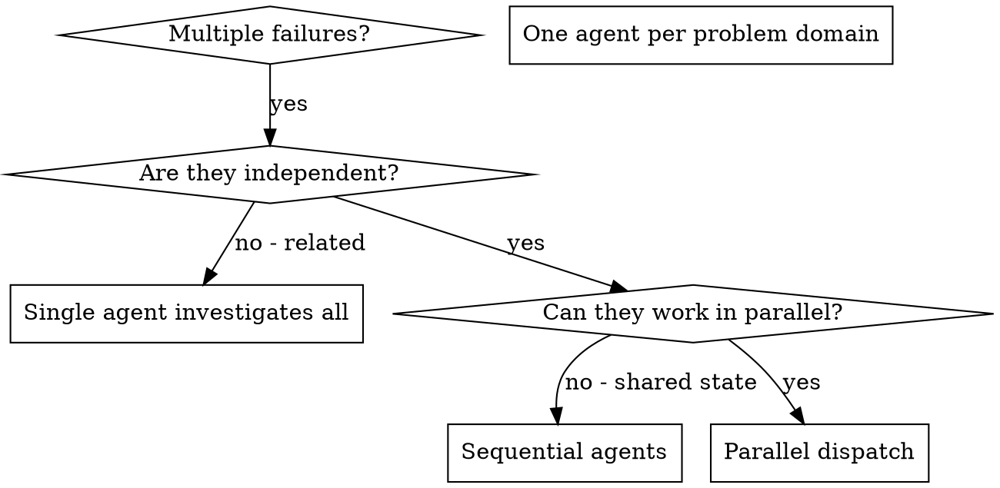

# Dispatching Parallel Agents

# 调度并行代理

## Overview

## 概览

When you have multiple unrelated failures (different test files, different subsystems, different bugs), investigating them sequentially wastes time. Each investigation is independent and can happen in parallel.

当你有多个不相关的故障（不同的测试文件、不同的子系统、不同的错误）时，按顺序调查它们会浪费时间。每个调查都是独立的，可以并行进行。

**Core principle:** Dispatch one agent per independent problem domain. Let them work concurrently.

**核心原则：**每个独立的问题领域调度一个代理。让它们并发工作。

## When to Use

## 何时使用



**Use when:**

**在以下情况使用：**

- 3+ test files failing with different root causes

- 3 个以上测试文件因不同的根本原因失败

- Multiple subsystems broken independently

- 多个子系统独立损坏

- Each problem can be understood without context from others

- 每个问题都可以在没有其他问题上下文的情况下被理解

- No shared state between investigations

- 调查之间没有共享状态

**Don't use when:**

**在以下情况不要使用：**

- Failures are related (fix one might fix others)

- 故障是相关的（修复一个可能会修复其他故障）

- Need to understand full system state

- 需要了解完整的系统状态

- Agents would interfere with each other

- 代理会互相干扰

## The Pattern

## 模式

### 1. Identify Independent Domains

### 1. 识别独立领域

Group failures by what's broken:

按损坏的内容对故障进行分组：

- File A tests: Tool approval flow

- 文件 A 测试：工具批准流程

- File B tests: Batch completion behavior

- 文件 B 测试：批处理完成行为

- File C tests: Abort functionality

- 文件 C 测试：中止功能

Each domain is independent - fixing tool approval doesn't affect abort tests.

每个领域都是独立的——修复工具批准不会影响中止测试。

### 2. Create Focused Agent Tasks

### 2. 创建专注的代理任务

Each agent gets:

每个代理获得：

- **Specific scope:** One test file or subsystem

- **特定范围：**一个测试文件或子系统

- **Clear goal:** Make these tests pass

- **明确目标：**让这些测试通过

- **Constraints:** Don't change other code

- **约束：**不要更改其他代码

- **Expected output:** Summary of what you found and fixed

- **预期输出：**你发现和修复内容的总结

### 3. Dispatch in Parallel

```typescript
// In Claude Code / AI environment
Task("Fix agent-tool-abort.test.ts failures");
Task("Fix batch-completion-behavior.test.ts failures");
Task("Fix tool-approval-race-conditions.test.ts failures");
// All three run concurrently
```

### 4. Review and Integrate

When agents return:

- Read each summary
- Verify fixes don't conflict
- Run full test suite
- Integrate all changes

## Agent Prompt Structure

## 代理提示结构

Good agent prompts are:

好的代理提示是：

1. **Focused** - One clear problem domain

1. **专注** - 一个明确的问题领域

1. **Self-contained** - All context needed to understand the problem

1. **自包含** - 理解问题所需的所有上下文

1. **Specific about output** - What should the agent return?

1. **输出具体** - 代理应该返回什么？

```markdown
Fix the 3 failing tests in src/agents/agent-tool-abort.test.ts:

1. "should abort tool with partial output capture" - expects 'interrupted at' in message
2. "should handle mixed completed and aborted tools" - fast tool aborted instead of completed
3. "should properly track pendingToolCount" - expects 3 results but gets 0

These are timing/race condition issues. Your task:

1. Read the test file and understand what each test verifies
2. Identify root cause - timing issues or actual bugs?
3. Fix by:
   - Replacing arbitrary timeouts with event-based waiting
   - Fixing bugs in abort implementation if found
   - Adjusting test expectations if testing changed behavior

Do NOT just increase timeouts - find the real issue.

Return: Summary of what you found and what you fixed.
```

## Common Mistakes

## 常见错误

**❌ Too broad:** "Fix all the tests" - agent gets lost

**❌ 太宽泛：**“修复所有测试” - 代理会迷失

**✅ Specific:** "Fix agent-tool-abort.test.ts" - focused scope

**✅ 具体：**“修复 agent-tool-abort.test.ts” - 范围专注

**❌ No context:** "Fix the race condition" - agent doesn't know where

**❌ 无上下文：**“修复竞争条件” - 代理不知道在哪里

**✅ Context:** Paste the error messages and test names

**✅ 上下文：**粘贴错误消息和测试名称

**❌ No constraints:** Agent might refactor everything

**❌ 无约束：**代理可能会重构所有内容

**✅ Constraints:** "Do NOT change production code" or "Fix tests only"

**✅ 约束：**“不要更改生产代码”或“仅修复测试”

**❌ Vague output:** "Fix it" - you don't know what changed

**❌ 输出模糊：**“修复它” - 你不知道改了什么

**✅ Specific:** "Return summary of root cause and changes"

**✅ 具体：**“返回根本原因和更改的总结”

## When NOT to Use

## 何时不要使用

**Related failures:** Fixing one might fix others - investigate together first

**相关故障：**修复一个可能会修复其他故障 - 先一起调查

**Need full context:** Understanding requires seeing entire system

**需要完整上下文：**理解需要查看整个系统

**Exploratory debugging:** You don't know what's broken yet

**探索性调试：**你还不知道哪里坏了

**Shared state:** Agents would interfere (editing same files, using same resources)

**共享状态：**代理会互相干扰（编辑相同的文件，使用相同的资源）

## Real Example from Session

## 来自会话的真实示例

**Scenario:** 6 test failures across 3 files after major refactoring

**场景：**重大重构后 3 个文件中的 6 个测试失败

**Failures:**

**故障：**

- agent-tool-abort.test.ts: 3 failures (timing issues)

- agent-tool-abort.test.ts: 3 个失败（时间问题）

- batch-completion-behavior.test.ts: 2 failures (tools not executing)

- batch-completion-behavior.test.ts: 2 个失败（工具未执行）

- tool-approval-race-conditions.test.ts: 1 failure (execution count = 0)

- tool-approval-race-conditions.test.ts: 1 个失败（执行计数 = 0）

**Decision:** Independent domains - abort logic separate from batch completion separate from race conditions

**决策：**独立领域 - 中止逻辑与批处理完成和竞争条件分开

**Dispatch:**

**调度：**

```
Agent 1 → Fix agent-tool-abort.test.ts
Agent 2 → Fix batch-completion-behavior.test.ts
Agent 3 → Fix tool-approval-race-conditions.test.ts
```

**Results:**

**结果：**

- Agent 1: Replaced timeouts with event-based waiting

- 代理 1：用基于事件的等待替换了超时

- Agent 2: Fixed event structure bug (threadId in wrong place)

- 代理 2：修复了事件结构错误（threadId 位置错误）

- Agent 3: Added wait for async tool execution to complete

- 代理 3：添加了等待异步工具执行完成

**Integration:** All fixes independent, no conflicts, full suite green

**集成：**所有修复独立，无冲突，完整套件通过（绿色）

**Time saved:** 3 problems solved in parallel vs sequentially

**节省时间：**并行解决 3 个问题 vs 顺序解决

## Key Benefits

## 关键好处

1. **Parallelization** - Multiple investigations happen simultaneously

1. **并行化** - 多个调查同时发生

1. **Focus** - Each agent has narrow scope, less context to track

1. **专注** - 每个代理范围狭窄，需要跟踪的上下文更少

1. **Independence** - Agents don't interfere with each other

1. **独立性** - 代理互不干扰

1. **Speed** - 3 problems solved in time of 1

1. **速度** - 1 个问题的时间解决 3 个问题

## Verification

## 验证

After agents return:

当代理返回时：

1. **Review each summary** - Understand what changed

1. **审查每个总结** - 了解更改了什么

1. **Check for conflicts** - Did agents edit same code?

1. **检查冲突** - 代理是否编辑了相同的代码？

1. **Run full suite** - Verify all fixes work together

1. **运行完整套件** - 验证所有修复一起工作

1. **Spot check** - Agents can make systematic errors

1. **抽查** - 代理可能会犯系统性错误

## Real-World Impact

## 现实世界的影响

From debugging session (2025-10-03):

来自调试会话 (2025-10-03)：

- 6 failures across 3 files

- 3 个文件中的 6 个失败

- 3 agents dispatched in parallel

- 并行调度了 3 个代理

- All investigations completed concurrently

- 所有调查并发完成

- All fixes integrated successfully

- 所有修复成功集成

- Zero conflicts between agent changes

- 代理更改之间零冲突
