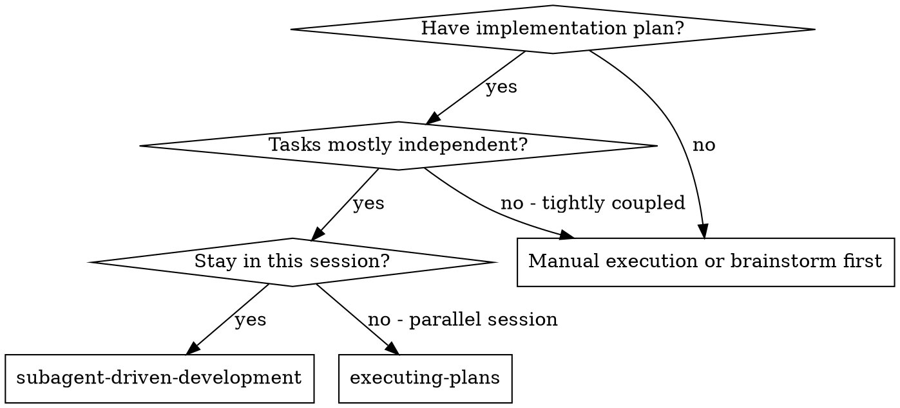
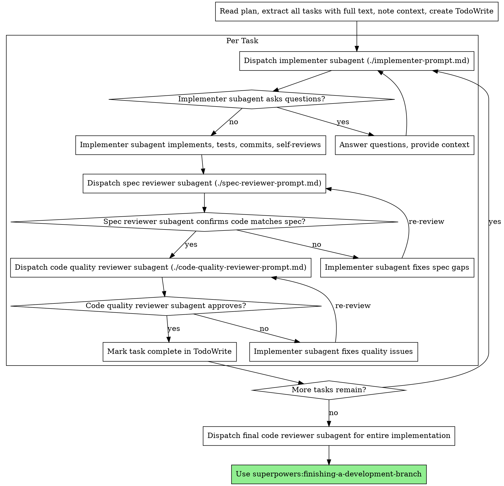

# Subagent-Driven Development

# 子代理驱动开发

Execute plan by dispatching fresh subagent per task, with two-stage review after each: spec compliance review first, then code quality review.

通过为每个任务调度新的子代理来执行计划，并在每个任务之后进行两阶段审查：首先是规格合规性审查，然后是代码质量审查。

**Core principle:** Fresh subagent per task + two-stage review (spec then quality) = high quality, fast iteration

**核心原则：**每个任务新的子代理 + 两阶段审查（规格然后质量）= 高质量，快速迭代

## When to Use

## 何时使用



**vs. Executing Plans (parallel session):**

**vs. 执行计划（并行会话）：**

- Same session (no context switch)

- 同一会话（无上下文切换）

- Fresh subagent per task (no context pollution)

- 每个任务新的子代理（无上下文污染）

- Two-stage review after each task: spec compliance first, then code quality

- 每个任务后两阶段审查：首先是规格合规性，然后是代码质量

- Faster iteration (no human-in-loop between tasks)

- 更快的迭代（任务之间没有人为干预）

## The Process

## 流程



## Prompt Templates

## 提示模板

- `./implementer-prompt.md` - Dispatch implementer subagent

- `./implementer-prompt.md` - 调度实施者子代理

- `./spec-reviewer-prompt.md` - Dispatch spec compliance reviewer subagent

- `./spec-reviewer-prompt.md` - 调度规格合规性审查子代理

- `./code-quality-reviewer-prompt.md` - Dispatch code quality reviewer subagent

- `./code-quality-reviewer-prompt.md` - 调度代码质量审查子代理

## Example Workflow

## 示例工作流

```
You: I'm using Subagent-Driven Development to execute this plan.

[Read plan file once: docs/plans/feature-plan.md]
[Extract all 5 tasks with full text and context]
[Create TodoWrite with all tasks]

Task 1: Hook installation script

[Get Task 1 text and context (already extracted)]
[Dispatch implementation subagent with full task text + context]

Implementer: "Before I begin - should the hook be installed at user or system level?"

You: "User level (~/.config/superpowers/hooks/)"

Implementer: "Got it. Implementing now..."
[Later] Implementer:
  - Implemented install-hook command
  - Added tests, 5/5 passing
  - Self-review: Found I missed --force flag, added it
  - Committed

[Dispatch spec compliance reviewer]
Spec reviewer: ✅ Spec compliant - all requirements met, nothing extra

[Get git SHAs, dispatch code quality reviewer]
Code reviewer: Strengths: Good test coverage, clean. Issues: None. Approved.

[Mark Task 1 complete]

Task 2: Recovery modes

[Get Task 2 text and context (already extracted)]
[Dispatch implementation subagent with full task text + context]

Implementer: [No questions, proceeds]
Implementer:
  - Added verify/repair modes
  - 8/8 tests passing
  - Self-review: All good
  - Committed

[Dispatch spec compliance reviewer]
Spec reviewer: ❌ Issues:
  - Missing: Progress reporting (spec says "report every 100 items")
  - Extra: Added --json flag (not requested)

[Implementer fixes issues]
Implementer: Removed --json flag, added progress reporting

[Spec reviewer reviews again]
Spec reviewer: ✅ Spec compliant now

[Dispatch code quality reviewer]
Code reviewer: Strengths: Solid. Issues (Important): Magic number (100)

[Implementer fixes]
Implementer: Extracted PROGRESS_INTERVAL constant

[Code reviewer reviews again]
Code reviewer: ✅ Approved

[Mark Task 2 complete]

...

[After all tasks]
[Dispatch final code-reviewer]
Final reviewer: All requirements met, ready to merge

Done!
```

## Advantages

## 优势

**vs. Manual execution:**

**vs. 手动执行：**

- Subagents follow TDD naturally

- 子代理自然遵循 TDD

- Fresh context per task (no confusion)

- 每个任务新的上下文（无混淆）

- Parallel-safe (subagents don't interfere)

- 并行安全（子代理互不干扰）

- Subagent can ask questions (before AND during work)

- 子代理可以提问（在工作之前和期间）

**vs. Executing Plans:**

**vs. 执行计划：**

- Same session (no handoff)

- 同一会话（无移交）

- Continuous progress (no waiting)

- 持续进展（无需等待）

- Review checkpoints automatic

- 审查检查点自动进行

**Efficiency gains:**

**效率提升：**

- No file reading overhead (controller provides full text)

- 无文件读取开销（控制器提供全文）

- Controller curates exactly what context is needed

- 控制器通过策划确切需要的上下文

- Subagent gets complete information upfront

- 子代理预先获得完整信息

- Questions surfaced before work begins (not after)

- 问题在工作开始前浮出水面（而不是之后）

**Quality gates:**

**质量关卡：**

- Self-review catches issues before handoff

- 自我审查在移交前捕获问题

- Two-stage review: spec compliance, then code quality

- 两阶段审查：规格合规性，然后是代码质量

- Review loops ensure fixes actually work

- 审查循环确保修复实际有效

- Spec compliance prevents over/under-building

- 规格合规性防止过度/不足构建

- Code quality ensures implementation is well-built

- 代码质量确保实施构建良好

**Cost:**

**成本：**

- More subagent invocations (implementer + 2 reviewers per task)

- 更多子代理调用（实施者 + 每个任务 2 个审查者）

- Controller does more prep work (extracting all tasks upfront)

- 控制器做更多的准备工作（预先提取所有任务）

- Review loops add iterations

- 审查循环增加迭代

- But catches issues early (cheaper than debugging later)

- 但尽早发现问题（比以后调试更便宜）

## Red Flags

## 危险信号

**Never:**

**永远不要：**

- Skip reviews (spec compliance OR code quality)

- 跳过审查（规格合规性或代码质量）

- Proceed with unfixed issues

- 继续存在未修复的问题

- Dispatch multiple implementation subagents in parallel (conflicts)

- 并行调度多个实施子代理（冲突）

- Make subagent read plan file (provide full text instead)

- 让子代理读取计划文件（改为提供全文）

- Skip scene-setting context (subagent needs to understand where task fits)

- 跳过场景设置上下文（子代理需要了解任务的位置）

- Ignore subagent questions (answer before letting them proceed)

- 忽略子代理问题（在让他们继续之前回答）

- Accept "close enough" on spec compliance (spec reviewer found issues = not done)

- 接受规格合规性上的“差不多”（规格审查者发现问题 = 未完成）

- Skip review loops (reviewer found issues = implementer fixes = review again)

- 跳过审查循环（审查者发现问题 = 实施者修复 = 再次审查）

- Let implementer self-review replace actual review (both are needed)

- 让实施者自我审查取代实际审查（两者都需要）

- **Start code quality review before spec compliance is ✅** (wrong order)

- **在规格合规性为 ✅ 之前开始代码质量审查**（错误顺序）

- Move to next task while either review has open issues

- 当任一审查有问题时移动到下一个任务

**If subagent asks questions:**

**如果子代理提问：**

- Answer clearly and completely

- 清晰完整地回答

- Provide additional context if needed

- 如果需要，提供额外的上下文

- Don't rush them into implementation

- 不要催促他们进入实施

**If reviewer finds issues:**

**如果审查者发现问题：**

- Implementer (same subagent) fixes them

- 实施者（同一个子代理）修复它们

- Reviewer reviews again

- 审查者再次审查

- Repeat until approved

- 重复直到批准

- Don't skip the re-review

- 不要跳过复审

**If subagent fails task:**

**如果子代理任务失败：**

- Dispatch fix subagent with specific instructions

- 调度修复子代理并提供具体指令

- Don't try to fix manually (context pollution)

- 不要尝试手动修复（上下文污染）

## Integration

## 集成

**Required workflow skills:**

**所需工作流技能：**

- **superpowers:writing-plans** - Creates the plan this skill executes

- **superpowers:writing-plans** - 创建此技能执行的计划

- **superpowers:requesting-code-review** - Code review template for reviewer subagents

- **superpowers:requesting-code-review** - 审查子代理的代码审查模板

- **superpowers:finishing-a-development-branch** - Complete development after all tasks

- **superpowers:finishing-a-development-branch** - 所有任务后完成开发

**Subagents should use:**

**子代理应该使用：**

- **superpowers:test-driven-development** - Subagents follow TDD for each task

- **superpowers:test-driven-development** - 子代理为每个任务遵循 TDD

**Alternative workflow:**

**替代工作流：**

- **superpowers:executing-plans** - Use for parallel session instead of same-session execution

- **superpowers:executing-plans** - 用于并行会话而不是同一会话执行
