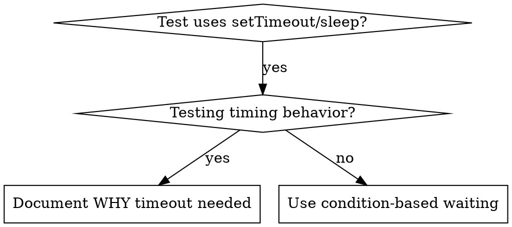

# Condition-Based Waiting

# 基于条件的等待

## Overview

## 概览

Flaky tests often guess at timing with arbitrary delays. This creates race conditions where tests pass on fast machines but fail under load or in CI.

不稳定的测试通常通过任意延迟来猜测时间。这会产生竞争条件，测试在快速机器上通过，但在负载下或 CI 中失败。

**Core principle:** Wait for the actual condition you care about, not a guess about how long it takes.

**核心原则：**等待你关心的实际条件，而不是猜测需要多长时间。

## When to Use

## 何时使用



**Use when:**

- Tests have arbitrary delays (`setTimeout`, `sleep`, `time.sleep()`)
- Tests are flaky (pass sometimes, fail under load)
- Tests timeout when run in parallel
- Waiting for async operations to complete

**在以下情况使用：**

- 测试有任意延迟 (`setTimeout`, `sleep`, `time.sleep()`)
- 测试不稳定（有时通过，在负载下失败）
- 测试在并行运行时超时
- 等待异步操作完成

**Don't use when:**

- Testing actual timing behavior (debounce, throttle intervals)
- Always document WHY if using arbitrary timeout

**在以下情况不要使用：**

- 测试实际时间行为（去抖动，节流间隔）
- 如果使用任意超时，始终记录原因

## Core Pattern

## 核心模式

```typescript
// ❌ BEFORE: Guessing at timing
await new Promise((r) => setTimeout(r, 50));
const result = getResult();
expect(result).toBeDefined();

// ✅ AFTER: Waiting for condition
await waitFor(() => getResult() !== undefined);
const result = getResult();
expect(result).toBeDefined();
```

## Quick Patterns

## 快速模式

| Scenario          | Pattern                                              |
| ----------------- | ---------------------------------------------------- |
| Wait for event    | `waitFor(() => events.find(e => e.type === 'DONE'))` |
| Wait for state    | `waitFor(() => machine.state === 'ready')`           |
| Wait for count    | `waitFor(() => items.length >= 5)`                   |
| Wait for file     | `waitFor(() => fs.existsSync(path))`                 |
| Complex condition | `waitFor(() => obj.ready && obj.value > 10)`         |

| 场景     | 模式                                                 |
| -------- | ---------------------------------------------------- |
| 等待事件 | `waitFor(() => events.find(e => e.type === 'DONE'))` |
| 等待状态 | `waitFor(() => machine.state === 'ready')`           |
| 等待计数 | `waitFor(() => items.length >= 5)`                   |
| 等待文件 | `waitFor(() => fs.existsSync(path))`                 |
| 复杂条件 | `waitFor(() => obj.ready && obj.value > 10)`         |

## Implementation

## 实施

Generic polling function:

通用轮询函数：

```typescript
async function waitFor<T>(
  condition: () => T | undefined | null | false,
  description: string,
  timeoutMs = 5000
): Promise<T> {
  const startTime = Date.now();

  while (true) {
    const result = condition();
    if (result) return result;

    if (Date.now() - startTime > timeoutMs) {
      throw new Error(
        `Timeout waiting for ${description} after ${timeoutMs}ms`
      );
    }

    await new Promise((r) => setTimeout(r, 10)); // Poll every 10ms
  }
}
```

See `condition-based-waiting-example.ts` in this directory for complete implementation with domain-specific helpers (`waitForEvent`, `waitForEventCount`, `waitForEventMatch`) from actual debugging session.

有关包含来自实际调试会话的特定领域帮助程序 (`waitForEvent`, `waitForEventCount`, `waitForEventMatch`) 的完整实施，请参阅此目录中的 `condition-based-waiting-example.ts`。

## Common Mistakes

## 常见错误

**❌ Polling too fast:** `setTimeout(check, 1)` - wastes CPU
**✅ Fix:** Poll every 10ms

**❌ 轮询太快：** `setTimeout(check, 1)` - 浪费 CPU
**✅ 修复：** 每 10ms 轮询一次

**❌ No timeout:** Loop forever if condition never met
**✅ Fix:** Always include timeout with clear error

**❌ 无超时：** 如果条件从未满足，则永远循环
**✅ 修复：** 始终包含带有清晰错误的超时

**❌ Stale data:** Cache state before loop
**✅ Fix:** Call getter inside loop for fresh data

**❌ 陈旧数据：** 循环前缓存状态
**✅ 修复：** 在循环内调用 getter 以获取新数据

## When Arbitrary Timeout IS Correct

## 何时任意超时是正确的

```typescript
// Tool ticks every 100ms - need 2 ticks to verify partial output
await waitForEvent(manager, "TOOL_STARTED"); // First: wait for condition
await new Promise((r) => setTimeout(r, 200)); // Then: wait for timed behavior
// 200ms = 2 ticks at 100ms intervals - documented and justified
```

**Requirements:**

1. First wait for triggering condition
2. Based on known timing (not guessing)
3. Comment explaining WHY

**要求：**

1. 首先等待触发条件
2. 基于已知时间（不是猜测）
3. 解释为什么的注释

## Real-World Impact

## 现实世界的影响

From debugging session (2025-10-03):

- Fixed 15 flaky tests across 3 files
- Pass rate: 60% → 100%
- Execution time: 40% faster
- No more race conditions

来自调试会话 (2025-10-03)：

- 修复了 3 个文件中的 15 个不稳定测试
- 通过率：60% → 100%
- 执行时间：快 40%
- 不再有竞争条件
