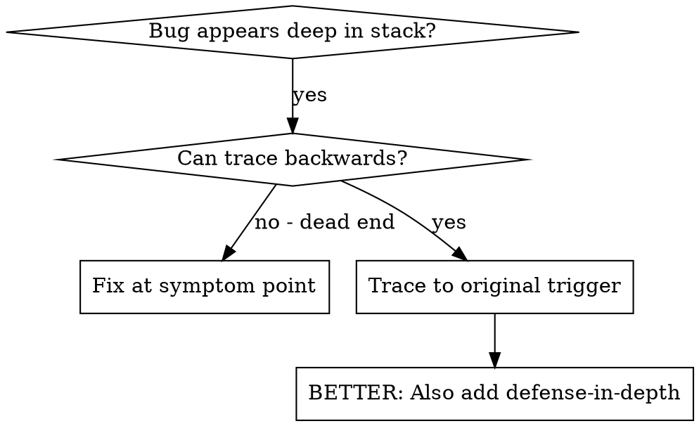
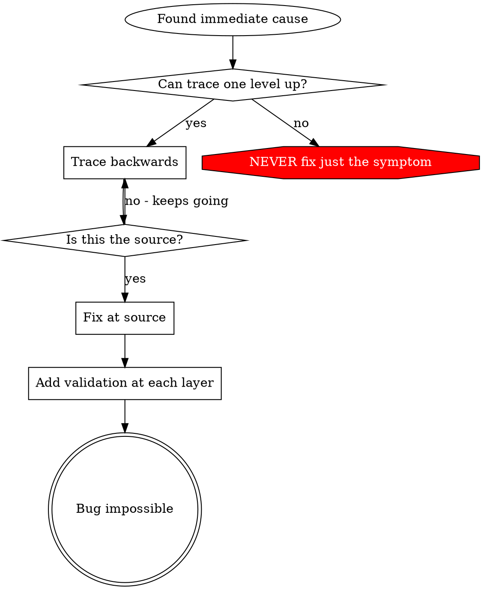

# Root Cause Tracing

# 根本原因跟踪

## Overview

## 概览

Bugs often manifest deep in the call stack (git init in wrong directory, file created in wrong location, database opened with wrong path). Your instinct is to fix where the error appears, but that's treating a symptom.

Bug 通常在调用堆栈的深处显现（git init 在错误的目录中，文件创建在错误的位置，数据库用错误的路径打开）。你的直觉是修复出现错误的地方，但这是治标不治本。

**Core principle:** Trace backward through the call chain until you find the original trigger, then fix at the source.

**核心原则：**通过调用链向后跟踪，直到找到原始触发器，然后从源头修复。

## When to Use

## 何时使用



**Use when:**

- Error happens deep in execution (not at entry point)
- Stack trace shows long call chain
- Unclear where invalid data originated
- Need to find which test/code triggers the problem

**在以下情况使用：**

- 错误发生在执行深处（不是在入口点）
- 堆栈跟踪显示长调用链
- 不清楚无效数据源自何处
- 需要找到哪个测试/代码触发了问题

## The Tracing Process

## 跟踪过程

### 1. Observe the Symptom

### 1. 观察症状

```
Error: git init failed in /Users/jesse/project/packages/core
```

### 2. Find Immediate Cause

**What code directly causes this?**

### 2. 找到直接原因

**什么代码直接导致了这个？**

```typescript
await execFileAsync("git", ["init"], { cwd: projectDir });
```

### 3. Ask: What Called This?

### 3. 询问：什么调用了这个？

```typescript
WorktreeManager.createSessionWorktree(projectDir, sessionId)
  → called by Session.initializeWorkspace()
  → called by Session.create()
  → called by test at Project.create()
```

### 4. Keep Tracing Up

**What value was passed?**

### 4. 继续向上跟踪

**传递了什么值？**

- `projectDir = ''` (empty string!)
- Empty string as `cwd` resolves to `process.cwd()`
- That's the source code directory!

### 5. Find Original Trigger

**Where did empty string come from?**

### 5. 找到原始触发器

**空字符串来自哪里？**

```typescript
const context = setupCoreTest(); // Returns { tempDir: '' }
Project.create("name", context.tempDir); // Accessed before beforeEach!
```

## Adding Stack Traces

## 添加堆栈跟踪

When you can't trace manually, add instrumentation:

当你无法手动跟踪时，添加仪器：

```typescript
// Before the problematic operation
async function gitInit(directory: string) {
  const stack = new Error().stack;
  console.error("DEBUG git init:", {
    directory,
    cwd: process.cwd(),
    nodeEnv: process.env.NODE_ENV,
    stack,
  });

  await execFileAsync("git", ["init"], { cwd: directory });
}
```

**Critical:** Use `console.error()` in tests (not logger - may not show)

**关键：**在测试中使用 `console.error()`（不要使用 logger - 可能不显示）

**Run and capture:**

**运行并捕获：**

```bash
npm test 2>&1 | grep 'DEBUG git init'
```

**Analyze stack traces:**

- Look for test file names
- Find the line number triggering the call
- Identify the pattern (same test? same parameter?)

**分析堆栈跟踪：**

- 查找测试文件名
- 找到触发调用的行号
- 识别模式（相同的测试？相同的参数？）

## Finding Which Test Causes Pollution

## 查找哪个测试导致污染

If something appears during tests but you don't know which test:

如果在测试期间出现某些东西但你不知道是哪个测试：

Use the bisection script `find-polluter.sh` in this directory:

使用此目录中的二分脚本 `find-polluter.sh`：

```bash
./find-polluter.sh '.git' 'src/**/*.test.ts'
```

Runs tests one-by-one, stops at first polluter. See script for usage.

逐个运行测试，在第一个污染者处停止。有关用法，请参阅脚本。

## Real Example: Empty projectDir

## 真实示例：空的 projectDir

**Symptom:** `.git` created in `packages/core/` (source code)

**症状：** `.git` 创建在 `packages/core/`（源代码）中

**Trace chain:**

1. `git init` runs in `process.cwd()` ← empty cwd parameter
2. WorktreeManager called with empty projectDir
3. Session.create() passed empty string
4. Test accessed `context.tempDir` before beforeEach
5. setupCoreTest() returns `{ tempDir: '' }` initially

**跟踪链：**

1. `git init` 在 `process.cwd()` 中运行 ← 空 cwd 参数
2. WorktreeManager 被调用，projectDir 为空
3. Session.create() 传递了空字符串
4. 测试在 beforeEach 之前访问了 `context.tempDir`
5. setupCoreTest() 最初返回 `{ tempDir: '' }`

**Root cause:** Top-level variable initialization accessing empty value

**根本原因：**顶层变量初始化访问空值

**Fix:** Made tempDir a getter that throws if accessed before beforeEach

**修复：**使 tempDir 成为一个 getter，如果在 beforeEach 之前访问则抛出异常

**Also added defense-in-depth:**

- Layer 1: Project.create() validates directory
- Layer 2: WorkspaceManager validates not empty
- Layer 3: NODE_ENV guard refuses git init outside tmpdir
- Layer 4: Stack trace logging before git init

**还添加了深度防御：**

- 第 1 层：Project.create() 验证目录
- 第 2 层：WorkspaceManager 验证非空
- 第 3 层：NODE_ENV 防护拒绝对 tmpdir 之外进行 git init
- 第 4 层：git init 之前的堆栈跟踪日志记录

## Key Principle

## 关键原则



**NEVER fix just where the error appears.** Trace back to find the original trigger.

**永远不要只修复错误出现的地方。**向后跟踪以找到原始触发器。

## Stack Trace Tips

## 堆栈跟踪技巧

**In tests:** Use `console.error()` not logger - logger may be suppressed
**Before operation:** Log before the dangerous operation, not after it fails
**Include context:** Directory, cwd, environment variables, timestamps
**Capture stack:** `new Error().stack` shows complete call chain

**在测试中：**使用 `console.error()` 而不是 logger - logger 可能会被抑制
**在操作之前：**在危险操作之前记录，而不是在失败之后
**包含上下文：**目录、cwd、环境变量、时间戳
**捕获堆栈：**`new Error().stack` 显示完整的调用链

## Real-World Impact

## 现实世界的影响

From debugging session (2025-10-03):

- Found root cause through 5-level trace
- Fixed at source (getter validation)
- Added 4 layers of defense
- 1847 tests passed, zero pollution

来自调试会话 (2025-10-03)：

- 通过 5 级跟踪找到根本原因
- 在源头修复（getter 验证）
- 添加了 4 层防御
- 1847 个测试通过，零污染
