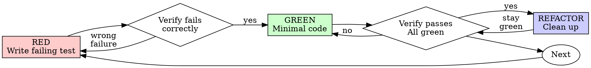

# Test-Driven Development (TDD)

# 测试驱动开发 (TDD)

## Overview

## 概览

Write the test first. Watch it fail. Write minimal code to pass.

先写测试。看它失败。编写最少的代码通过。

**Core principle:** If you didn't watch the test fail, you don't know if it tests the right thing.

**核心原则：**如果你没有看到测试失败，你就不知道它是否测试了正确的东西。

**Violating the letter of the rules is violating the spirit of the rules.**

**违反规则的字面意思就是违反规则的精神。**

## When to Use

## 何时使用

**Always:**

- New features
- Bug fixes
- Refactoring
- Behavior changes

**始终：**

- 新功能
- Bug 修复
- 重构
- 行为改变

**Exceptions (ask your human partner):**

- Throwaway prototypes
- Generated code
- Configuration files

**例外情况（询问你的人类合作伙伴）：**

- 废弃原型
- 生成的代码
- 配置文件

Thinking "skip TDD just this once"? Stop. That's rationalization.

想“就这一次跳过 TDD”吗？停止。那是合理化。

## The Iron Law

## 铁律

```
NO PRODUCTION CODE WITHOUT A FAILING TEST FIRST

没有先失败的测试就没有生产代码
```

Write code before the test? Delete it. Start over.

测试前写代码？删除它。重新开始。

**No exceptions:**

- Don't keep it as "reference"
- Don't "adapt" it while writing tests
- Don't look at it
- Delete means delete

**无例外：**

- 不要将其保留为“参考”
- 不要在编写测试时“调整”它
- 不要看它
- 删除意味着删除

Implement fresh from tests. Period.

根据测试重新实现。句号。

## Red-Green-Refactor

## 红-绿-重构



### RED - Write Failing Test

### 红 - 编写失败测试

Write one minimal test showing what should happen.

编写一个显示应该发生什么的最小测试。

<Good>
```typescript
test('retries failed operations 3 times', async () => {
  let attempts = 0;
  const operation = () => {
    attempts++;
    if (attempts < 3) throw new Error('fail');
    return 'success';
  };

const result = await retryOperation(operation);

expect(result).toBe('success');
expect(attempts).toBe(3);
});

````
Clear name, tests real behavior, one thing

清晰的名称，测试真实行为，一件事
</Good>

<Bad>
```typescript
test('retry works', async () => {
  const mock = jest.fn()
    .mockRejectedValueOnce(new Error())
    .mockRejectedValueOnce(new Error())
    .mockResolvedValueOnce('success');
  await retryOperation(mock);
  expect(mock).toHaveBeenCalledTimes(3);
});
````

Vague name, tests mock not code

模糊的名称，测试模拟而不是代码
</Bad>

**Requirements:**

- One behavior
- Clear name
- Real code (no mocks unless unavoidable)

**要求：**

- 一个行为
- 清晰的名称
- 真实代码（除非不可避免，否则没有模拟）

### Verify RED - Watch It Fail

### 验证红 - 看它失败

**MANDATORY. Never skip.**

**强制性。永远不要跳过。**

```bash
npm test path/to/test.test.ts
```

Confirm:

- Test fails (not errors)
- Failure message is expected
- Fails because feature missing (not typos)

确认：

- 测试失败（不是错误）
- 失败消息符合预期
- 失败原因是因为功能缺失（不是拼写错误）

**Test passes?** You're testing existing behavior. Fix test.

**测试通过？**你正在测试现有行为。修复测试。

**Test errors?** Fix error, re-run until it fails correctly.

**测试错误？**修复错误，重新运行直到它正确失败。

### GREEN - Minimal Code

### 绿 - 最小代码

Write simplest code to pass the test.

编写最简单的代码以通过测试。

<Good>
```typescript
async function retryOperation<T>(fn: () => Promise<T>): Promise<T> {
  for (let i = 0; i < 3; i++) {
    try {
      return await fn();
    } catch (e) {
      if (i === 2) throw e;
    }
  }
  throw new Error('unreachable');
}
```
Just enough to pass

刚好足够通过
</Good>

<Bad>
```typescript
async function retryOperation<T>(
  fn: () => Promise<T>,
  options?: {
    maxRetries?: number;
    backoff?: 'linear' | 'exponential';
    onRetry?: (attempt: number) => void;
  }
): Promise<T> {
  // YAGNI
}
```
Over-engineered

过度设计
</Bad>

Don't add features, refactor other code, or "improve" beyond the test.

不要添加功能、重构其他代码或在测试之外进行“改进”。

### Verify GREEN - Watch It Pass

### 验证绿 - 看它通过

**MANDATORY.**

**强制性。**

```bash
npm test path/to/test.test.ts
```

Confirm:

- Test passes
- Other tests still pass
- Output pristine (no errors, warnings)

确认：

- 测试通过
- 其他测试仍然通过
- 输出原始（无错误、警告）

**Test fails?** Fix code, not test.

**测试失败？**修复代码，而不是测试。

**Other tests fail?** Fix now.

**其他测试失败？**现在修复。

### REFACTOR - Clean Up

### 重构 - 清理

After green only:

- Remove duplication
- Improve names
- Extract helpers

仅在绿色之后：

- 删除重复
- 改进名称
- 提取助手

Keep tests green. Don't add behavior.

保持测试绿色。不要添加行为。

### Repeat

### 重复

Next failing test for next feature.

下一个功能的下一个失败测试。

## Good Tests

## 好的测试

| Quality          | Good                                | Bad                                                 |
| ---------------- | ----------------------------------- | --------------------------------------------------- |
| **Minimal**      | One thing. "and" in name? Split it. | `test('validates email and domain and whitespace')` |
| **Clear**        | Name describes behavior             | `test('test1')`                                     |
| **Shows intent** | Demonstrates desired API            | Obscures what code should do                        |

| 质量         | 好                             | 坏                                                  |
| ------------ | ------------------------------ | --------------------------------------------------- |
| **最小**     | 一件事。名字里有“和”？拆分它。 | `test('validates email and domain and whitespace')` |
| **清晰**     | 名称描述行为                   | `test('test1')`                                     |
| **显示意图** | 演示所需的 API                 | 模糊代码应该做什么                                  |

## Why Order Matters

## 为什么顺序很重要

**"I'll write tests after to verify it works"**

**“我会在这之后写测试以验证它是否有效”**

Tests written after code pass immediately. Passing immediately proves nothing:

- Might test wrong thing
- Might test implementation, not behavior
- Might miss edge cases you forgot
- You never saw it catch the bug

代码之后编写的测试立即通过。立即通过证明不了什么：

- 可能测试了错误的东西
- 可能测试了实现，而不是行为
- 可能错过了你忘记的边缘情况
- 你从未见过它捕获 bug

Test-first forces you to see the test fail, proving it actually tests something.

测试优先迫使你看到测试失败，证明它实际上测试了一些东西。

**"I already manually tested all the edge cases"**

**“我已经手动测试了所有边缘情况”**

Manual testing is ad-hoc. You think you tested everything but:

- No record of what you tested
- Can't re-run when code changes
- Easy to forget cases under pressure
- "It worked when I tried it" ≠ comprehensive

手动测试是临时的。你认为你测试了一切，但是：

- 没有你测试过的记录
- 当代码更改时无法重新运行
- 在压力下容易忘记情况
- “当我尝试时它是有效的” ≠ 全面的

Automated tests are systematic. They run the same way every time.

自动化测试是系统的。它们每次都以相同的方式运行。

**"Deleting X hours of work is wasteful"**

**“删除 X 小时的工作是浪费”**

Sunk cost fallacy. The time is already gone. Your choice now:

- Delete and rewrite with TDD (X more hours, high confidence)
- Keep it and add tests after (30 min, low confidence, likely bugs)

沉没成本谬误。时间已经过去了。你现在的选择：

- 删除并用 TDD 重写（X 多个小时，高置信度）
- 保留它并在之后添加测试（30 分钟，低置信度，可能有 bug）

The "waste" is keeping code you can't trust. Working code without real tests is technical debt.

“浪费”是保留你无法信任的代码。没有真实测试的工作代码是技术债务。

**"TDD is dogmatic, being pragmatic means adapting"**

**“TDD 是教条式的，务实意味着适应”**

TDD IS pragmatic:

- Finds bugs before commit (faster than debugging after)
- Prevents regressions (tests catch breaks immediately)
- Documents behavior (tests show how to use code)
- Enables refactoring (change freely, tests catch breaks)

TDD **是**务实的：

- 在提交之前发现 bug（比之后调试更快）
- 防止回归（测试立即捕获破坏）
- 记录行为（测试显示如何使用代码）
- 启用重构（自由更改，测试捕获破坏）

"Pragmatic" shortcuts = debugging in production = slower.

“务实”捷径 = 在生产中调试 = 更慢。

**"Tests after achieve the same goals - it's spirit not ritual"**

**“之后的测试实现了相同的目标 - 这是精神而不是仪式”**

No. Tests-after answer "What does this do?" Tests-first answer "What should this do?"

不。之后的测试回答“这做了什么？”先测试回答“这应该做什么？”

Tests-after are biased by your implementation. You test what you built, not what's required. You verify remembered edge cases, not discovered ones.

之后的测试因你的实现而有偏差。你测试你构建的内容，而不是所需的内容。你验证记住的边缘情况，而不是发现的边缘情况。

Tests-first force edge case discovery before implementing. Tests-after verify you remembered everything (you didn't).

先测试强制在实施之前发现边缘情况。之后的测试验证你记住了一切（你没有）。

30 minutes of tests after ≠ TDD. You get coverage, lose proof tests work.

之后的 30 分钟测试 ≠ TDD。你获得了覆盖率，失去了测试工作的证据。

## Common Rationalizations

## 常见合理化

| Excuse                                 | Reality                                                                 |
| -------------------------------------- | ----------------------------------------------------------------------- |
| "Too simple to test"                   | Simple code breaks. Test takes 30 seconds.                              |
| "I'll test after"                      | Tests passing immediately prove nothing.                                |
| "Tests after achieve same goals"       | Tests-after = "what does this do?" Tests-first = "what should this do?" |
| "Already manually tested"              | Ad-hoc ≠ systematic. No record, can't re-run.                           |
| "Deleting X hours is wasteful"         | Sunk cost fallacy. Keeping unverified code is technical debt.           |
| "Keep as reference, write tests first" | You'll adapt it. That's testing after. Delete means delete.             |
| "Need to explore first"                | Fine. Throw away exploration, start with TDD.                           |
| "Test hard = design unclear"           | Listen to test. Hard to test = hard to use.                             |
| "TDD will slow me down"                | TDD faster than debugging. Pragmatic = test-first.                      |
| "Manual test faster"                   | Manual doesn't prove edge cases. You'll re-test every change.           |
| "Existing code has no tests"           | You're improving it. Add tests for existing code.                       |

| 借口                         | 现实                                                 |
| ---------------------------- | ---------------------------------------------------- |
| “太简单无法测试”             | 简单的代码会中断。测试需要 30 秒。                   |
| “我以后再测试”               | 立即通过测试证明不了什么。                           |
| “之后的测试实现了相同的目标” | 之后的测试 = “这做了什么？”先测试 = “这应该做什么？” |
| “已经手动测试过了”           | 临时 ≠ 系统。没有记录，无法重新运行。                |
| “删除 X 小时是浪费”          | 沉没成本谬误。保留未验证的代码是技术债务。           |
| “保留作为参考，先写测试”     | 你会调整它。那是以后测试。删除意味着删除。           |
| “需要先探索”                 | 好的。扔掉探索，从 TDD 开始。                        |
| “测试难 = 设计不清楚”        | 听测试。难以测试 = 难以使用。                        |
| “TDD 会让我慢下来”           | TDD 比调试快。务实 = 测试优先。                      |
| “手动测试更快”               | 手动不能证明边缘情况。你会重新测试每一个更改。       |
| “现有代码没有测试”           | 你正在改进它。为现有代码添加测试。                   |

## Red Flags - STOP and Start Over

## 危险信号 - 停止并重新开始

- Code before test
- Test after implementation
- Test passes immediately
- Can't explain why test failed
- Tests added "later"
- Rationalizing "just this once"
- "I already manually tested it"
- "Tests after achieve the same purpose"
- "It's about spirit not ritual"
- "Keep as reference" or "adapt existing code"
- "Already spent X hours, deleting is wasteful"
- "TDD is dogmatic, I'm being pragmatic"
- "This is different because..."

- 测试前代码
- 实施后测试
- 测试立即通过
- 无法解释测试为何失败
- 测试“稍后”添加
- 合理化“就这一次”
- “我已经手动测试过了”
- “之后的测试达到相同的目的”
- “这是关于精神而不是仪式”
- “保留作为参考”或“适应现有代码”
- “已经花了 X 小时，删除是浪费”
- “TDD 是教条式的，我很务实”
- “这不同，因为......”

**All of these mean: Delete code. Start over with TDD.**

**所有这些意味着：删除代码。从 TDD 重新开始。**

## Example: Bug Fix

## 示例：Bug 修复

**Bug:** Empty email accepted

**Bug：** 接受空电子邮件

**RED**

```typescript
test("rejects empty email", async () => {
  const result = await submitForm({ email: "" });
  expect(result.error).toBe("Email required");
});
```

**Verify RED**

```bash
$ npm test
FAIL: expected 'Email required', got undefined
```

**GREEN**

```typescript
function submitForm(data: FormData) {
  if (!data.email?.trim()) {
    return { error: "Email required" };
  }
  // ...
}
```

**Verify GREEN**

```bash
$ npm test
PASS
```

**REFACTOR**
Extract validation for multiple fields if needed.

**重构**
如果需要，提取多个字段的验证。

## Verification Checklist

## 验证清单

Before marking work complete:

在标记工作完成之前：

- [ ] Every new function/method has a test
- [ ] Watched each test fail before implementing
- [ ] Each test failed for expected reason (feature missing, not typo)
- [ ] Wrote minimal code to pass each test
- [ ] All tests pass
- [ ] Output pristine (no errors, warnings)
- [ ] Tests use real code (mocks only if unavoidable)
- [ ] Edge cases and errors covered

- [ ] 每个新函数/方法都有测试
- [ ] 在实施之前观察每个测试失败
- [ ] 每个测试都因预期原因失败（功能缺失，而不是拼写错误）
- [ ] 编写最少的代码以通过每个测试
- [ ] 所有测试通过
- [ ] 输出原始（无错误、警告）
- [ ] 测试使用真实代码（仅当不可避免时才模拟）
- [ ] 覆盖边缘情况和错误

Can't check all boxes? You skipped TDD. Start over.

不能勾选所有的框？你跳过了 TDD。重新开始。

## When Stuck

## 卡住时

| Problem                | Solution                                                             |
| ---------------------- | -------------------------------------------------------------------- |
| Don't know how to test | Write wished-for API. Write assertion first. Ask your human partner. |
| Test too complicated   | Design too complicated. Simplify interface.                          |
| Must mock everything   | Code too coupled. Use dependency injection.                          |
| Test setup huge        | Extract helpers. Still complex? Simplify design.                     |

| 问题           | 解决方案                                             |
| -------------- | ---------------------------------------------------- |
| 不知道如何测试 | 编写希望的 API。首先编写断言。询问你的人类合作伙伴。 |
| 测试太复杂     | 设计太复杂。简化界面。                               |
| 必须模拟一切   | 代码太耦合。使用依赖注入。                           |
| 测试设置巨大   | 提取助手。还复杂吗？简化设计。                       |

## Debugging Integration

## 调试集成

Bug found? Write failing test reproducing it. Follow TDD cycle. Test proves fix and prevents regression.

发现 Bug？编写失败的测试来重现它。遵循 TDD 周期。测试证明修复并防止回归。

Never fix bugs without a test.

永远不要在没有测试的情况下修复 bug。

## Testing Anti-Patterns

## 测试反模式

When adding mocks or test utilities, read @testing-anti-patterns.md to avoid common pitfalls:

- Testing mock behavior instead of real behavior
- Adding test-only methods to production classes
- Mocking without understanding dependencies

添加模拟或测试实用程序时，请阅读 @testing-anti-patterns.md 以避免常见陷阱：

- 测试模拟行为而不是真实行为
- 向生产类添加仅限测试的方法
- 在不了解依赖关系的情况下进行模拟

## Final Rule

## 最终规则

```
Production code → test exists and failed first
Otherwise → not TDD
```

No exceptions without your human partner's permission.

未经你的人类合作伙伴许可，不得例外。
