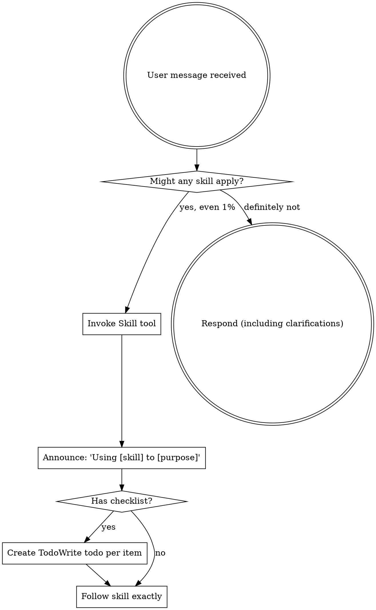

<EXTREMELY-IMPORTANT>
If you think there is even a 1% chance a skill might apply to what you are doing, you ABSOLUTELY MUST invoke the skill.

如果认为哪怕有 1% 的机会可以将某项技能应用于你正在做的事情，你**绝对必须**调用该技能。

IF A SKILL APPLIES TO YOUR TASK, YOU DO NOT HAVE A CHOICE. YOU MUST USE IT.

如果一项技能适用于你的任务，你没有选择。你必须使用它。

This is not negotiable. This is not optional. You cannot rationalize your way out of this.
</EXTREMELY-IMPORTANT>

这是没有商量余地的。这不是可选的。你不能用理由逃避这一点。
</EXTREMELY-IMPORTANT>

## How to Access Skills

## 如何访问技能

**In Claude Code:** Use the `Skill` tool. When you invoke a skill, its content is loaded and presented to you—follow it directly. Never use the Read tool on skill files.

**在 Claude Code 中：**使用 `Skill` 工具。当你调用一项技能时，其内容会被加载并呈现给你——直接遵循它。永远不要对技能文件使用 Read 工具。

**In other environments:** Check your platform's documentation for how skills are loaded.

**在其他环境中：**查看你的平台文档，了解技能是如何加载的。

# Using Skills

# 使用技能

## The Rule

## 规则

**Invoke relevant or requested skills BEFORE any response or action.** Even a 1% chance a skill might apply means that you should invoke the skill to check. If an invoked skill turns out to be wrong for the situation, you don't need to use it.

**在任何响应或行动之前调用相关或请求的技能。**即使有 1% 的机会可能适用一项技能，也意味着你应该调用该技能进行检查。如果是调用的技能对于该情况是错误的，你不需要使用它。

## Red Flags

## 危险信号

These thoughts mean STOP—you're rationalizing:

这些想法意味着停止——你在找借口：

| Thought                             | Reality                                                |
| ----------------------------------- | ------------------------------------------------------ |
| "This is just a simple question"    | Questions are tasks. Check for skills.                 |
| "I need more context first"         | Skill check comes BEFORE clarifying questions.         |
| "Let me explore the codebase first" | Skills tell you HOW to explore. Check first.           |
| "I can check git/files quickly"     | Files lack conversation context. Check for skills.     |
| "Let me gather information first"   | Skills tell you HOW to gather information.             |
| "This doesn't need a formal skill"  | If a skill exists, use it.                             |
| "I remember this skill"             | Skills evolve. Read current version.                   |
| "This doesn't count as a task"      | Action = task. Check for skills.                       |
| "The skill is overkill"             | Simple things become complex. Use it.                  |
| "I'll just do this one thing first" | Check BEFORE doing anything.                           |
| "This feels productive"             | Undisciplined action wastes time. Skills prevent this. |

| 想法                           | 现实                                              |
| ------------------------------ | ------------------------------------------------- |
| “这只是一个简单的问题”         | 问题就是任务。检查技能。                          |
| “如果是这样，我需要更多上下文” | 技能检查在澄清问题**之前**。                      |
| “让我先探索一下代码库”         | 技能告诉你**如何**探索。先检查。                  |
| “我可以快速检查 git/文件”      | 文件缺乏对话上下文。检查技能。                    |
| “让我先收集信息”               | 技能告诉你**如何**收集信息。                      |
| “这不需要正式的技能”           | 如果技能存在，使用它。                            |
| “我记得这个技能”               | 技能会演变。阅读当前版本。                        |
| “这不算作任务”                 | 行动 = 任务。检查技能。                           |
| “技能是大材小用”               | 简单的事情会变得复杂。使用它。                    |
| “我先做这件事”                 | 在做任何事情**之前**检查。                        |
| “这感觉有效率”                 | 无纪律的行动浪费时间。技能防止这种情况。          |
| "I know what that means"       | Knowing the concept ≠ using the skill. Invoke it. |

| “我知道那是什么意思” | 知道概念 ≠ 使用技能。调用它。 |

## Skill Priority

## 技能优先级

When multiple skills could apply, use this order:

当多个技能可能适用时，使用此顺序：

1. **Process skills first** (brainstorming, debugging) - these determine HOW to approach the task

1. **流程技能优先** (brainstorming, debugging) - 这些决定**如何**处理任务

1. **Implementation skills second** (frontend-design, mcp-builder) - these guide execution

1. **实施技能其次** (frontend-design, mcp-builder) - 这些指导执行

"Let's build X" → brainstorming first, then implementation skills.

“让我们构建 X” → 首先进行头脑风暴，然后是实施技能。

"Fix this bug" → debugging first, then domain-specific skills.

“修复此错误” → 首先进行调试，然后是领域特定技能。

## Skill Types

## 技能类型

**Rigid** (TDD, debugging): Follow exactly. Don't adapt away discipline.

**刚性** (TDD, debugging)：严格遵循。不要为了适应而放弃纪律。

**Flexible** (patterns): Adapt principles to context.

**灵活** (patterns)：使原则适应上下文。

The skill itself tells you which.

技能本身会告诉你属于哪一种。

## User Instructions

## 用户指令

Instructions say WHAT, not HOW. "Add X" or "Fix Y" doesn't mean skip workflows.

指令说的是**什么**，而不是**如何**。“添加 X”或“修复 Y”并不意味着跳过工作流。
