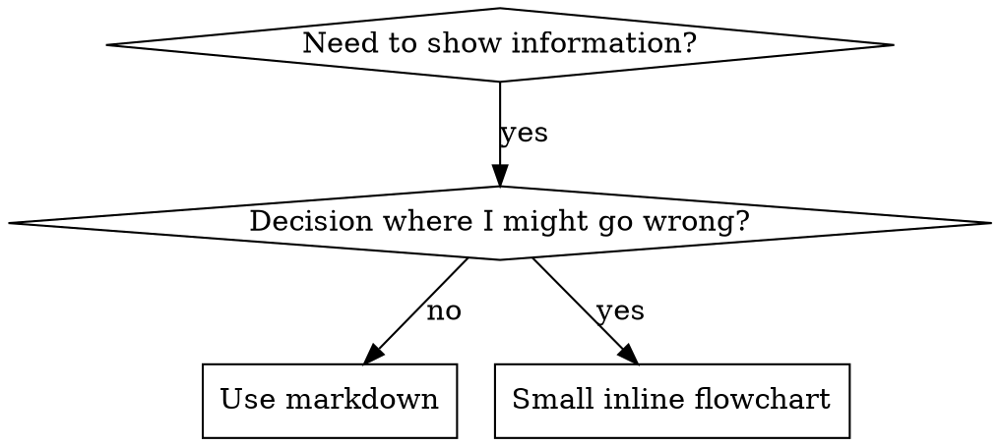

# Writing Skills

## Overview

**Writing skills IS Test-Driven Development applied to process documentation.**

**编写技能就是应用于流程文档的测试驱动开发。**

**Personal skills live in agent-specific directories (`~/.claude/skills` for Claude Code, `~/.codex/skills` for Codex)**

**个人技能位于特定于代理的目录中（Claude Code 为 `~/.claude/skills`，Codex 为 `~/.codex/skills`）**

You write test cases (pressure scenarios with subagents), watch them fail (baseline behavior), write the skill (documentation), watch tests pass (agents comply), and refactor (close loopholes).

你编写测试用例（带有子代理的压力场景），观察它们失败（基线行为），编写技能（文档），观察测试通过（代理遵守），并重构（堵住漏洞）。

**Core principle:** If you didn't watch an agent fail without the skill, you don't know if the skill teaches the right thing.

**核心原则：**如果你没有观察到代理在没有技能的情况下失败，你就不知道技能是否教授了正确的东西。

**REQUIRED BACKGROUND:** You MUST understand superpowers:test-driven-development before using this skill. That skill defines the fundamental RED-GREEN-REFACTOR cycle. This skill adapts TDD to documentation.

**所需背景：**在使用此技能之前，你必须了解 superpowers:test-driven-development。该技能定义了基本的红-绿-重构循环。此技能将 TDD 调整为文档。

**Official guidance:** For Anthropic's official skill authoring best practices, see anthropic-best-practices.md. This document provides additional patterns and guidelines that complement the TDD-focused approach in this skill.

**官方指南：**有关 Anthropic 的官方技能创作最佳实践，请参阅 anthropic-best-practices.md。本文档提供了补充此技能中以 TDD 为中心的方法的额外模式和指南。

## What is a Skill?

## 什么是技能？

A **skill** is a reference guide for proven techniques, patterns, or tools. Skills help future Claude instances find and apply effective approaches.

**技能**是经过验证的技术、模式或工具的参考指南。技能帮助未来的 Claude 实例找到并应用有效的方法。

**Skills are:** Reusable techniques, patterns, tools, reference guides

**技能是：**可重用的技术、模式、工具、参考指南

**Skills are NOT:** Narratives about how you solved a problem once

**技能不是：**关于你曾经如何解决问题的叙述

## TDD Mapping for Skills

## 技能的 TDD 映射

| TDD Concept             | Skill Creation                                   |
| ----------------------- | ------------------------------------------------ |
| **Test case**           | Pressure scenario with subagent                  |
| **Production code**     | Skill document (SKILL.md)                        |
| **Test fails (RED)**    | Agent violates rule without skill (baseline)     |
| **Test passes (GREEN)** | Agent complies with skill present                |
| **Refactor**            | Close loopholes while maintaining compliance     |
| **Write test first**    | Run baseline scenario BEFORE writing skill       |
| **Watch it fail**       | Document exact rationalizations agent uses       |
| **Minimal code**        | Write skill addressing those specific violations |
| **Watch it pass**       | Verify agent now complies                        |
| **Refactor cycle**      | Find new rationalizations → plug → re-verify     |

| TDD 概念            | 技能创建                               |
| ------------------- | -------------------------------------- |
| **测试用例**        | 带有子代理的压力场景                   |
| **生产代码**        | 技能文档 (SKILL.md)                    |
| **测试失败 (红色)** | 代理在没有技能的情况下违反规则（基线） |
| **测试通过 (绿色)** | 代理在有技能的情况下遵守规则           |
| **重构**            | 在保持合规性的同时堵住漏洞             |
| **先写测试**        | 在编写技能之前运行基线场景             |
| **看它失败**        | 记录代理使用的确切理由                 |
| **最少代码**        | 编写针对那些特定违规行为的技能         |
| **看它通过**        | 验证代理现在是否合规                   |
| **重构循环**        | 找到新的理由 → 堵塞 → 重新验证         |

The entire skill creation process follows RED-GREEN-REFACTOR.

整个技能创建过程遵循红-绿-重构。

## When to Create a Skill

## 何时创建技能

**Create when:**

- Technique wasn't intuitively obvious to you
- You'd reference this again across projects
- Pattern applies broadly (not project-specific)
- Others would benefit

**创建，当：**

- 技术对你来说不是直观显而易见的
- 你会在跨项目中再次引用此内容
- 模式广泛适用（非特定于项目）
- 其他人会受益

**Don't create for:**

- One-off solutions
- Standard practices well-documented elsewhere
- Project-specific conventions (put in CLAUDE.md)
- Mechanical constraints (if it's enforceable with regex/validation, automate it—save documentation for judgment calls)

**不要创建，为：**

- 一次性解决方案
- 其他地方已有详细记录的标准做法
- 特定于项目的约定（放入 CLAUDE.md）
- 机械约束（如果可以用 regex/验证强制执行，请自动化它——将文档留给判断调用）

## Skill Types

## 技能类型

### Technique

Concrete method with steps to follow (condition-based-waiting, root-cause-tracing)

### 技术

带有后续步骤的具体方法（基于条件的等待，根本原因追踪）

### Pattern

Way of thinking about problems (flatten-with-flags, test-invariants)

### 模式

思考问题的方式（使用标志扁平化，测试不变量）

### Reference

API docs, syntax guides, tool documentation (office docs)

### 参考

API 文档，语法指南，工具文档（办公文档）

## Directory Structure

## 目录结构

```
skills/
  skill-name/
    SKILL.md              # Main reference (required)
    supporting-file.*     # Only if needed
```

**Flat namespace** - all skills in one searchable namespace

**扁平命名空间** - 所有技能在一个可搜索的命名空间中

**Separate files for:**

1. **Heavy reference** (100+ lines) - API docs, comprehensive syntax
2. **Reusable tools** - Scripts, utilities, templates

**单独的文件用于：**

1. **大量参考**（100+ 行） - API 文档，综合语法
2. **可重用工具** - 脚本，实用程序，模板

**Keep inline:**

- Principles and concepts
- Code patterns (< 50 lines)
- Everything else

**保持内联：**

- 原则和概念
- 代码模式（< 50 行）
- 其他一切

## SKILL.md Structure

## SKILL.md 结构

**Frontmatter (YAML):**

- Only two fields supported: `name` and `description`
- Max 1024 characters total
- `name`: Use letters, numbers, and hyphens only (no parentheses, special chars)
- `description`: Third-person, describes ONLY when to use (NOT what it does)
  - Start with "Use when..." to focus on triggering conditions
  - Include specific symptoms, situations, and contexts
  - **NEVER summarize the skill's process or workflow** (see CSO section for why)
  - Keep under 500 characters if possible

**Frontmatter (YAML):**

- 仅支持两个字段：`name` 和 `description`
- 总共不超过 1024 个字符
- `name`：仅使用字母、数字和连字符（无括号、特殊字符）
- `description`：第三人称，仅描述何时使用（不是它做什么）
  - 以 "Use when..." 开头以关注触发条件
  - 包括具体的症状、情况和背景
  - **绝不总结技能的过程或工作流**（有关原因，请参阅 CSO 部分）
  - 如果可能，保持在 500 个字符以下

```markdown
---
name: Skill-Name-With-Hyphens
description: Use when [specific triggering conditions and symptoms]
---

# Skill Name

## Overview

What is this? Core principle in 1-2 sentences.

## When to Use

[Small inline flowchart IF decision non-obvious]

Bullet list with SYMPTOMS and use cases
When NOT to use

## Core Pattern (for techniques/patterns)

Before/after code comparison

## Quick Reference

Table or bullets for scanning common operations

## Implementation

Inline code for simple patterns
Link to file for heavy reference or reusable tools

## Common Mistakes

What goes wrong + fixes

## Real-World Impact (optional)

Concrete results
```

## Claude Search Optimization (CSO)

## Claude 搜索优化 (CSO)

**Critical for discovery:** Future Claude needs to FIND your skill

**对于发现至关重要：**未来的 Claude 需要找到你的技能

### 1. Rich Description Field

### 1. 丰富的描述字段

**Purpose:** Claude reads description to decide which skills to load for a given task. Make it answer: "Should I read this skill right now?"

**目的：**Claude 读取描述以决定为给定任务加载哪些技能。让它回答：“我现在应该阅读这个技能吗？”

**Format:** Start with "Use when..." to focus on triggering conditions

**格式：**以 "Use when..." 开头以关注触发条件

**CRITICAL: Description = When to Use, NOT What the Skill Does**

**关键：描述 = 何时使用，而不是技能做什么**

The description should ONLY describe triggering conditions. Do NOT summarize the skill's process or workflow in the description.

描述应仅描述触发条件。不要在描述中总结技能的过程或工作流。

**Why this matters:** Testing revealed that when a description summarizes the skill's workflow, Claude may follow the description instead of reading the full skill content. A description saying "code review between tasks" caused Claude to do ONE review, even though the skill's flowchart clearly showed TWO reviews (spec compliance then code quality).

**为什么这很重要：**测试显示，当描述总结技能的工作流时，Claude 可能会遵循描述而不是阅读完整的技能内容。说“任务之间的代码审查”的描述导致 Claude 进行一次审查，即使技能的流程图清楚地显示了两次审查（规范合规性，然后是代码质量）。

When the description was changed to just "Use when executing implementation plans with independent tasks" (no workflow summary), Claude correctly read the flowchart and followed the two-stage review process.

当描述仅更改为“在执行具有独立任务的实施计划时使用”（无工作流摘要）时，Claude 正确读取了流程图并遵循了两个阶段的审查过程。

**The trap:** Descriptions that summarize workflow create a shortcut Claude will take. The skill body becomes documentation Claude skips.

**陷阱：**总结工作流的描述创建了 Claude 将采取的捷径。技能正文变成了 Claude 跳过的文档。

```yaml
# ❌ BAD: Summarizes workflow - Claude may follow this instead of reading skill
description: Use when executing plans - dispatches subagent per task with code review between tasks

# ❌ 坏：总结工作流 - Claude 可能会遵循此操作而不是阅读技能
description: Use when executing plans - dispatches subagent per task with code review between tasks

# ❌ BAD: Too much process detail
description: Use for TDD - write test first, watch it fail, write minimal code, refactor

# ❌ 坏：太多流程细节
description: Use for TDD - write test first, watch it fail, write minimal code, refactor

# ✅ GOOD: Just triggering conditions, no workflow summary
description: Use when executing implementation plans with independent tasks in the current session

# ✅ 好：仅触发条件，无工作流摘要
description: Use when executing implementation plans with independent tasks in the current session

# ✅ GOOD: Triggering conditions only
description: Use when implementing any feature or bugfix, before writing implementation code

# ✅ 好：仅触发条件
description: Use when implementing any feature or bugfix, before writing implementation code
```

**Content:**

- Use concrete triggers, symptoms, and situations that signal this skill applies
- Describe the _problem_ (race conditions, inconsistent behavior) not _language-specific symptoms_ (setTimeout, sleep)
- Keep triggers technology-agnostic unless the skill itself is technology-specific
- If skill is technology-specific, make that explicit in the trigger
- Write in third person (injected into system prompt)
- **NEVER summarize the skill's process or workflow**

**内容：**

- 使用具体的触发器、症状和情况来表明此技能适用
- 描述 _问题_（竞争条件，不一致的行为）而不是 _特定于语言的症状_ (setTimeout, sleep)
- 保持触发器与技术无关，除非技能本身是特定于技术的
- 如果技能是特定于技术的，请在触发器中明确说明
- 用第三人称写作（注入系统提示符）
- **绝不总结技能的过程或工作流**

```yaml
# ❌ BAD: Too abstract, vague, doesn't include when to use
description: For async testing

# ❌ 坏：太抽象，模糊，不包括何时使用
description: For async testing

# ❌ BAD: First person
description: I can help you with async tests when they're flaky

# ❌ 坏：第一人称
description: I can help you with async tests when they're flaky

# ❌ BAD: Mentions technology but skill isn't specific to it
description: Use when tests use setTimeout/sleep and are flaky

# ❌ 坏：提到了技术，但技能并非专门针对它
description: Use when tests use setTimeout/sleep and are flaky

# ✅ GOOD: Starts with "Use when", describes problem, no workflow
description: Use when tests have race conditions, timing dependencies, or pass/fail inconsistently

# ✅ 好：以 "Use when" 开头，描述问题，无工作流
description: Use when tests have race conditions, timing dependencies, or pass/fail inconsistently

# ✅ GOOD: Technology-specific skill with explicit trigger
description: Use when using React Router and handling authentication redirects

# ✅ 好：具有明确触发器的特定于技术的技能
description: Use when using React Router and handling authentication redirects
```

### 2. Keyword Coverage

### 2. 关键词覆盖

Use words Claude would search for:

- Error messages: "Hook timed out", "ENOTEMPTY", "race condition"
- Symptoms: "flaky", "hanging", "zombie", "pollution"
- Synonyms: "timeout/hang/freeze", "cleanup/teardown/afterEach"
- Tools: Actual commands, library names, file types

使用 Claude 会搜索的词：

- 错误消息："Hook timed out", "ENOTEMPTY", "race condition"
- 症状："flaky", "hanging", "zombie", "pollution"
- 同义词："timeout/hang/freeze", "cleanup/teardown/afterEach"
- 工具：实际命令，库名称，文件类型

### 3. Descriptive Naming

### 3. 描述性命名

**Use active voice, verb-first:**

- ✅ `creating-skills` not `skill-creation`
- ✅ `condition-based-waiting` not `async-test-helpers`

**使用主动语态，动词优先：**

- ✅ `creating-skills` 不是 `skill-creation`
- ✅ `condition-based-waiting` 不是 `async-test-helpers`

### 4. Token Efficiency (Critical)

### 4. Token 效率（关键）

**Problem:** getting-started and frequently-referenced skills load into EVERY conversation. Every token counts.

**问题：**getting-started 和频繁引用的技能会加载到每个对话中。每个 token 都很重要。

**Target word counts:**

- getting-started workflows: <150 words each
- Frequently-loaded skills: <200 words total
- Other skills: <500 words (still be concise)

**目标字数统计：**

- getting-started workflows：每个 <150 字
- Keep loaded skills：总计 <200 字
- Other skills：<500 字（仍需简洁）

**Techniques:**

**技巧：**

**Move details to tool help:**

**将详细信息移至工具帮助：**

```bash
# ❌ BAD: Document all flags in SKILL.md
search-conversations supports --text, --both, --after DATE, --before DATE, --limit N

# ❌ 坏：在 SKILL.md 中记录所有标志
search-conversations supports --text, --both, --after DATE, --before DATE, --limit N

# ✅ GOOD: Reference --help
search-conversations supports multiple modes and filters. Run --help for details.

# ✅ 好：参考 --help
search-conversations supports multiple modes and filters. Run --help for details.
```

**Use cross-references:**

**使用交叉引用：**

```markdown
# ❌ BAD: Repeat workflow details

When searching, dispatch subagent with template...
[20 lines of repeated instructions]

# ❌ 坏：重复工作流细节

When searching, dispatch subagent with template...
[20 lines of repeated instructions]

# ✅ GOOD: Reference other skill

Always use subagents (50-100x context savings). REQUIRED: Use [other-skill-name] for workflow.

# ✅ 好：参考其他技能

Always use subagents (50-100x context savings). REQUIRED: Use [other-skill-name] for workflow.
```

**Compress examples:**

**压缩示例：**

```markdown
# ❌ BAD: Verbose example (42 words)

your human partner: "How did we handle authentication errors in React Router before?"
You: I'll search past conversations for React Router authentication patterns.
[Dispatch subagent with search query: "React Router authentication error handling 401"]

# ❌ 坏：冗长的示例（42 个字）

your human partner: "How did we handle authentication errors in React Router before?"
You: I'll search past conversations for React Router authentication patterns.
[Dispatch subagent with search query: "React Router authentication error handling 401"]

# ✅ GOOD: Minimal example (20 words)

Partner: "How did we handle auth errors in React Router?"
You: Searching...
[Dispatch subagent → synthesis]

# ✅ 好：最小示例（20 个字）

Partner: "How did we handle auth errors in React Router?"
You: Searching...
[Dispatch subagent → synthesis]
```

**Eliminate redundancy:**

- Don't repeat what's in cross-referenced skills
- Don't explain what's obvious from command
- Don't include multiple examples of same pattern

**消除冗余：**

- 不要重复交叉引用的技能中的内容
- 不要解释命令中显而易见的内容
- 不要包含相同模式的多个示例

**Verification:**

```bash
wc -w skills/path/SKILL.md
# getting-started workflows: aim for <150 each
# Other frequently-loaded: aim for <200 total

wc -w skills/path/SKILL.md
# getting-started workflows: aim for <150 each
# Other frequently-loaded: aim for <200 total
```

**Name by what you DO or core insight:**

- ✅ `condition-based-waiting` > `async-test-helpers`
- ✅ `using-skills` not `skill-usage`
- ✅ `flatten-with-flags` > `data-structure-refactoring`
- ✅ `root-cause-tracing` > `debugging-techniques`

**根据你所做的或核心见解命名：**

- ✅ `condition-based-waiting` > `async-test-helpers`
- ✅ `using-skills` not `skill-usage`
- ✅ `flatten-with-flags` > `data-structure-refactoring`
- ✅ `root-cause-tracing` > `debugging-techniques`

**Gerunds (-ing) work well for processes:**

- `creating-skills`, `testing-skills`, `debugging-with-logs`
- Active, describes the action you're taking

### 4. Cross-Referencing Other Skills

### 4. 交叉引用其他技能

**When writing documentation that references other skills:**

**编写引用其他技能的文档时：**

Use skill name only, with explicit requirement markers:

- ✅ Good: `**REQUIRED SUB-SKILL:** Use superpowers:test-driven-development`
- ✅ Good: `**REQUIRED BACKGROUND:** You MUST understand superpowers:systematic-debugging`
- ❌ Bad: `See skills/testing/test-driven-development` (unclear if required)
- ❌ Bad: `@skills/testing/test-driven-development/SKILL.md` (force-loads, burns context)

**Why no @ links:** `@` syntax force-loads files immediately, consuming 200k+ context before you need them.

**为什么没有 @ 链接：**`@` 语法会立即强制加载文件，在你需要它们之前消耗 200k+ 上下文。

## Flowchart Usage

## 流程图使用



**Use flowcharts ONLY for:**

- Non-obvious decision points
- Process loops where you might stop too early
- "When to use A vs B" decisions

**Never use flowcharts for:**

- Reference material → Tables, lists
- Code examples → Markdown blocks
- Linear instructions → Numbered lists
- Labels without semantic meaning (step1, helper2)

See @graphviz-conventions.dot for graphviz style rules.

有关 graphviz 样式规则，请参阅 @graphviz-conventions.dot。

**Visualizing for your human partner:** Use `render-graphs.js` in this directory to render a skill's flowcharts to SVG:

**为人类合作伙伴可视化：**使用此目录中的 `render-graphs.js` 将技能的流程图渲染为 SVG：

```bash
./render-graphs.js ../some-skill           # Each diagram separately
./render-graphs.js ../some-skill --combine # All diagrams in one SVG
```

## Code Examples

## 代码示例

**One excellent example beats many mediocre ones**

**一个优秀的例子胜过许多平庸的例子**

Choose most relevant language:

- Testing techniques → TypeScript/JavaScript
- System debugging → Shell/Python
- Data processing → Python

**Good example:**

- Complete and runnable
- Well-commented explaining WHY
- From real scenario
- Shows pattern clearly
- Ready to adapt (not generic template)

**Don't:**

- Implement in 5+ languages
- Create fill-in-the-blank templates
- Write contrived examples

You're good at porting - one great example is enough.

你擅长移植 - 一个很棒的例子就足够了。

## File Organization

## 文件组织

### Self-Contained Skill

### 独立技能

```
defense-in-depth/
  SKILL.md    # Everything inline
```

When: All content fits, no heavy reference needed

何时：所有内容都适合，不需要大量参考

### Skill with Reusable Tool

### 具有可重用工具的技能

```
condition-based-waiting/
  SKILL.md    # Overview + patterns
  example.ts  # Working helpers to adapt
```

When: Tool is reusable code, not just narrative

何时：工具是可重用的代码，不仅仅是叙述

### Skill with Heavy Reference

### 具有大量参考的技能

```
pptx/
  SKILL.md       # Overview + workflows
  pptxgenjs.md   # 600 lines API reference
  ooxml.md       # 500 lines XML structure
  scripts/       # Executable tools
```

When: Reference material too large for inline

何时：参考资料太大，无法内联

## The Iron Law (Same as TDD)

## 铁律（与 TDD 相同）

```
NO SKILL WITHOUT A FAILING TEST FIRST

没有首先失败的测试就没有技能
```

This applies to NEW skills AND EDITS to existing skills.

这适用于新技能和现有技能的编辑。

Write skill before testing? Delete it. Start over.
Edit skill without testing? Same violation.

在测试之前编写技能？删除它。重新开始。
在没有测试的情况下编辑技能？同样的违规行为。

**No exceptions:**

- Not for "simple additions"
- Not for "just adding a section"
- Not for "documentation updates"
- Don't keep untested changes as "reference"
- Don't "adapt" while running tests
- Delete means delete

**REQUIRED BACKGROUND:** The superpowers:test-driven-development skill explains why this matters. Same principles apply to documentation.

**所需背景：**superpowers:test-driven-development 技能解释了这种做法的重要性。相同的原则适用于文档。

## Testing All Skill Types

## 测试所有技能类型

Different skill types need different test approaches:

不同的技能类型需要不同的测试方法：

### Discipline-Enforcing Skills (rules/requirements)

### 执行纪律的技能（规则/要求）

**Examples:** TDD, verification-before-completion, designing-before-coding

**示例：**TDD, verification-before-completion, designing-before-coding

**Test with:**

- Academic questions: Do they understand the rules?
- Pressure scenarios: Do they comply under stress?
- Multiple pressures combined: time + sunk cost + exhaustion
- Identify rationalizations and add explicit counters

**Success criteria:** Agent follows rule under maximum pressure

**成功标准：**代理在最大压力下遵循规则

### Technique Skills (how-to guides)

### 技术技能（操作指南）

**Examples:** condition-based-waiting, root-cause-tracing, defensive-programming

**示例：**condition-based-waiting, root-cause-tracing, defensive-programming

**Test with:**

- Application scenarios: Can they apply the technique correctly?
- Variation scenarios: Do they handle edge cases?
- Missing information tests: Do instructions have gaps?

**Success criteria:** Agent successfully applies technique to new scenario

**成功标准：**代理成功地将技术应用于新场景

### Pattern Skills (mental models)

### 模式技能（思维模型）

**Examples:** reducing-complexity, information-hiding concepts

**示例：**reducing-complexity, information-hiding concepts

**Test with:**

- Recognition scenarios: Do they recognize when pattern applies?
- Application scenarios: Can they use the mental model?
- Counter-examples: Do they know when NOT to apply?

**Success criteria:** Agent correctly identifies when/how to apply pattern

**成功标准：**代理正确识别何时/如何应用模式

### Reference Skills (documentation/APIs)

### 参考技能（文档/API）

**Examples:** API documentation, command references, library guides

**示例：**API 文档，命令参考，库指南

**Test with:**

- Retrieval scenarios: Can they find the right information?
- Application scenarios: Can they use what they found correctly?
- Gap testing: Are common use cases covered?

**Success criteria:** Agent finds and correctly applies reference information

**成功标准：**代理查找并正确应用参考信息

## Common Rationalizations for Skipping Testing

## 跳过测试的常见理由

| Excuse                         | Reality                                                          |
| ------------------------------ | ---------------------------------------------------------------- |
| "Skill is obviously clear"     | Clear to you ≠ clear to other agents. Test it.                   |
| "It's just a reference"        | References can have gaps, unclear sections. Test retrieval.      |
| "Testing is overkill"          | Untested skills have issues. Always. 15 min testing saves hours. |
| "I'll test if problems emerge" | Problems = agents can't use skill. Test BEFORE deploying.        |
| "Too tedious to test"          | Testing is less tedious than debugging bad skill in production.  |
| "I'm confident it's good"      | Overconfidence guarantees issues. Test anyway.                   |
| "Academic review is enough"    | Reading ≠ using. Test application scenarios.                     |
| "No time to test"              | Deploying untested skill wastes more time fixing it later.       |

**All of these mean: Test before deploying. No exceptions.**

**所有这些都意味着：在部署之前进行测试。没有例外。**

## Bulletproofing Skills Against Rationalization

## 针对合理化的防弹技能

Skills that enforce discipline (like TDD) need to resist rationalization. Agents are smart and will find loopholes when under pressure.

执行纪律（如 TDD）的技能需要抵制合理化。代理很聪明，在压力下会找到漏洞。

**Psychology note:** Understanding WHY persuasion techniques work helps you apply them systematically. See persuasion-principles.md for research foundation (Cialdini, 2021; Meincke et al., 2025) on authority, commitment, scarcity, social proof, and unity principles.

**心理学笔记：**了解说服技巧为何起作用有助于你系统地应用它们。有关权威、承诺、稀缺性、社会认同和统一原则的研究基础 (Cialdini, 2021; Meincke et al., 2025)，请参阅 persuasion-principles.md。

### Close Every Loophole Explicitly

### 明确关闭每个漏洞

Don't just state the rule - forbid specific workarounds:

不要只是陈述规则——禁止具体的解决方法：

<Bad>
```markdown
Write code before test? Delete it.
```
</Bad>

<Good>
```markdown
Write code before test? Delete it. Start over.

写代码前先测试？删除它。重新开始。

**No exceptions:**

- Don't keep it as "reference"
- Don't "adapt" it while writing tests
- Don't look at it
- Delete means delete

````
</Good>

### Address "Spirit vs Letter" Arguments

### 解决“精神与文字”的争论

Add foundational principle early:

尽早添加基本原则：

```markdown
**Violating the letter of the rules is violating the spirit of the rules.**

**违反规则的文字就是违反规则的精神。**
````

This cuts off entire class of "I'm following the spirit" rationalizations.

这切断了整个“我正在追随精神”的合理化。

### Build Rationalization Table

### 构建合理化表

Capture rationalizations from baseline testing (see Testing section below). Every excuse agents make goes in the table:

从基线测试中捕获合理化（请参阅下面的测试部分）。代理人提出的每一个借口都会在表格中：

```markdown
| Excuse                           | Reality                                                                 |
| -------------------------------- | ----------------------------------------------------------------------- |
| "Too simple to test"             | Simple code breaks. Test takes 30 seconds.                              |
| "I'll test after"                | Tests passing immediately prove nothing.                                |
| "Tests after achieve same goals" | Tests-after = "what does this do?" Tests-first = "what should this do?" |
```

### Create Red Flags List

### 创建危险信号列表

Make it easy for agents to self-check when rationalizing:

让代理在合理化时轻松进行自我检查：

```markdown
## Red Flags - STOP and Start Over

- Code before test
- "I already manually tested it"
- "Tests after achieve the same purpose"
- "It's about spirit not ritual"
- "This is different because..."

**All of these mean: Delete code. Start over with TDD.**
```

```markdown
## 危险信号 - 停止并重新开始

- 测试前先写代码
- "我已经手动测试过了"
- "之后的测试达到同样的目的"
- "这是关于精神而不是仪式"
- "这是不同的，因为..."

**所有这些都意味着：删除代码。使用 TDD 重新开始。**
```

### Update CSO for Violation Symptoms

### 更新违反症状的 CSO

Add to description: symptoms of when you're ABOUT to violate the rule:

添加到描述：当你即将违反规则时的症状：

```yaml
description: use when implementing any feature or bugfix, before writing implementation code
```

## RED-GREEN-REFACTOR for Skills

## 技能的红-绿-重构

Follow the TDD cycle:

遵循 TDD 循环：

### RED: Write Failing Test (Baseline)

### 红色：编写失败测试（基线）

Run pressure scenario with subagent WITHOUT the skill. Document exact behavior:

- What choices did they make?
- What rationalizations did they use (verbatim)?
- Which pressures triggered violations?

This is "watch the test fail" - you must see what agents naturally do before writing the skill.

在没有技能的情况下，使用子代理运行压力场景。记录确切的行为：

- 他们做了什么选择？
- 他们使用了什么理由（逐字）？
- 哪些压力引发了违规行为？

这是“观察测试失败”——你必须在编写技能之前看看代理自然会做什么。

### GREEN: Write Minimal Skill

### 绿色：编写最小技能

Write skill that addresses those specific rationalizations. Don't add extra content for hypothetical cases.

Run same scenarios WITH skill. Agent should now comply.

编写针对这些特定理由的技能。不要为假设情况添加额外内容。

使用技能运行相同的场景。代理现在应该遵守。

### REFACTOR: Close Loopholes

### 重构：堵住漏洞

Agent found new rationalization? Add explicit counter. Re-test until bulletproof.

**Testing methodology:** See @testing-skills-with-subagents.md for the complete testing methodology:

- How to write pressure scenarios
- Pressure types (time, sunk cost, authority, exhaustion)
- Plugging holes systematically
- Meta-testing techniques

代理发现了新的理由？添加明确的计数器。重新测试直到防弹。

**测试方法：**有关完整的测试方法，请参阅 @testing-skills-with-subagents.md：

- 如何编写压力场景
- 压力类型（时间、沉没成本、权威、疲惫）
- 系统地堵住漏洞
- 元测试技术

## Anti-Patterns

## 反模式

### ❌ Narrative Example

### ❌ 叙事示例

"In session 2025-10-03, we found empty projectDir caused..."
**Why bad:** Too specific, not reusable

"In session 2025-10-03, we found empty projectDir caused..."
**为什么不好：**太具体，不可复用

### ❌ Multi-Language Dilution

### ❌ 多语言稀释

example-js.js, example-py.py, example-go.go
**Why bad:** Mediocre quality, maintenance burden

example-js.js, example-py.py, example-go.go
**为什么不好：**质量平庸，维护负担

### ❌ Code in Flowcharts

### ❌ 流程图中的代码

```dot
step1 [label="import fs"];
step2 [label="read file"];
```

**Why bad:** Can't copy-paste, hard to read

**为什么不好：**无法复制粘贴，难以阅读

### ❌ Generic Labels

### ❌ 通用标签

helper1, helper2, step3, pattern4
**Why bad:** Labels should have semantic meaning

helper1, helper2, step3, pattern4
**为什么不好：**标签应具有语义含义

## STOP: Before Moving to Next Skill

## 停止：在移动到下一个技能之前

**After writing ANY skill, you MUST STOP and complete the deployment process.**

**在编写任何技能后，你必须停止并完成部署过程。**

**Do NOT:**

**不要：**

- Create multiple skills in batch without testing each
- Move to next skill before current one is verified
- Skip testing because "batching is more efficient"

- 批量创建多个技能而不测试每个技能
- 在验证当前技能之前移动到下一个技能
- 跳过测试因为“批处理更有效”

**The deployment checklist below is MANDATORY for EACH skill.**

**下面的部署清单对于每个技能都是强制性的。**

Deploying untested skills = deploying untested code. It's a violation of quality standards.

部署未经测试的技能 = 部署未经测试的代码。这违反了质量标准。

## Skill Creation Checklist (TDD Adapted)

## 技能创建清单（TDD 改编）

**IMPORTANT: Use TodoWrite to create todos for EACH checklist item below.**

**重要：使用 TodoWrite 为下面的每个清单项创建待办事项。**

**RED Phase - Write Failing Test:**

- [ ] Create pressure scenarios (3+ combined pressures for discipline skills)
- [ ] Run scenarios WITHOUT skill - document baseline behavior verbatim
- [ ] Identify patterns in rationalizations/failures

**红色阶段 - 编写失败测试：**

- [ ] 创建压力场景（纪律技能的 3+ 组合压力）
- [ ] 在没有技能的情况下运行场景 - 逐字记录基线行为
- [ ] 识别合理化/失败中的模式

**GREEN Phase - Write Minimal Skill:**

- [ ] Name uses only letters, numbers, hyphens (no parentheses/special chars)
- [ ] YAML frontmatter with only name and description (max 1024 chars)
- [ ] Description starts with "Use when..." and includes specific triggers/symptoms
- [ ] Description written in third person
- [ ] Keywords throughout for search (errors, symptoms, tools)
- [ ] Clear overview with core principle
- [ ] Address specific baseline failures identified in RED
- [ ] Code inline OR link to separate file
- [ ] One excellent example (not multi-language)
- [ ] Run scenarios WITH skill - verify agents now comply

**绿色阶段 - 编写最小技能：**

- [ ] 名称仅使用字母、数字、连字符（无括号/特殊字符）
- [ ] 仅包含名称和描述的 YAML frontmatter（最多 1024 个字符）
- [ ] 描述以 "Use when..." 开头并包括特定的触发器/症状
- [ ] 用第三人称写的描述
- [ ] 搜索的关键字（错误、症状、工具）
- [ ] 具有核心原则的清晰概述
- [ ] 解决红色中确定的特定基线故障
- [ ] 代码内联或链接到单独的文件
- [ ] 一个优秀的例子（不是多语言）
- [ ] 使用技能运行场景 - 验证代理现在是否合规

**REFACTOR Phase - Close Loopholes:**

- [ ] Identify NEW rationalizations from testing
- [ ] Add explicit counters (if discipline skill)
- [ ] Build rationalization table from all test iterations
- [ ] Create red flags list
- [ ] Re-test until bulletproof

**重构阶段 - 堵住漏洞：**

- [ ] 识别测试中的新理由
- [ ] 添加明确的计数器（如果是纪律技能）
- [ ] 从所有测试迭代中构建合理化表
- [ ] 创建危险信号列表
- [ ] 重新测试直到防弹

**Quality Checks:**

- [ ] Small flowchart only if decision non-obvious
- [ ] Quick reference table
- [ ] Common mistakes section
- [ ] No narrative storytelling
- [ ] Supporting files only for tools or heavy reference

**质量检查：**

- [ ] 仅当决定不明显时才使用小流程图
- [ ] 快速参考表
- [ ] 常见错误部分
- [ ] 没有叙事故事
- [ ] 仅用于工具或大量参考的支持文件

**Deployment:**

- [ ] Commit skill to git and push to your fork (if configured)
- [ ] Consider contributing back via PR (if broadly useful)

**部署：**

- [ ] 将技能提交给 git 并推送到你的 fork（如果已配置）
- [ ] 考虑通过 PR 回馈（如果广泛有用）

## Discovery Workflow

## 发现工作流

How future Claude finds your skill:

1. **Encounters problem** ("tests are flaky")
2. **Finds SKILL** (description matches)
3. **Scans overview** (is this relevant?)
4. **Reads patterns** (quick reference table)
5. **Loads example** (only when implementing)

未来的 Claude 如何找到你的技能：

1. **遇到问题** ("测试不稳定")
2. **查找技能** (描述匹配)
3. **扫描概述** (这相关吗？)
4. **阅读模式** (快速参考表)
5. **加载示例** (仅在实施时)

**Optimize for this flow** - put searchable terms early and often.

**为此流程优化** - 尽早并经常放置可搜索的术语。

## The Bottom Line

## 总结

**Creating skills IS TDD for process documentation.**

**创建技能就是流程文档的 TDD。**

Same Iron Law: No skill without failing test first.
Same cycle: RED (baseline) → GREEN (write skill) → REFACTOR (close loopholes).
Same benefits: Better quality, fewer surprises, bulletproof results.

相同的铁律：没有首先失败的测试就没有技能。
相同的循环：红色（基线）→ 绿色（编写技能）→ 重构（堵住漏洞）。
相同的好处：更好的质量，更少的惊喜，防弹的结果。

If you follow TDD for code, follow it for skills. It's the same discipline applied to documentation.

如果你遵循 TDD 进行代码，请遵循它进行技能。这是应用于文档的相同纪律。
